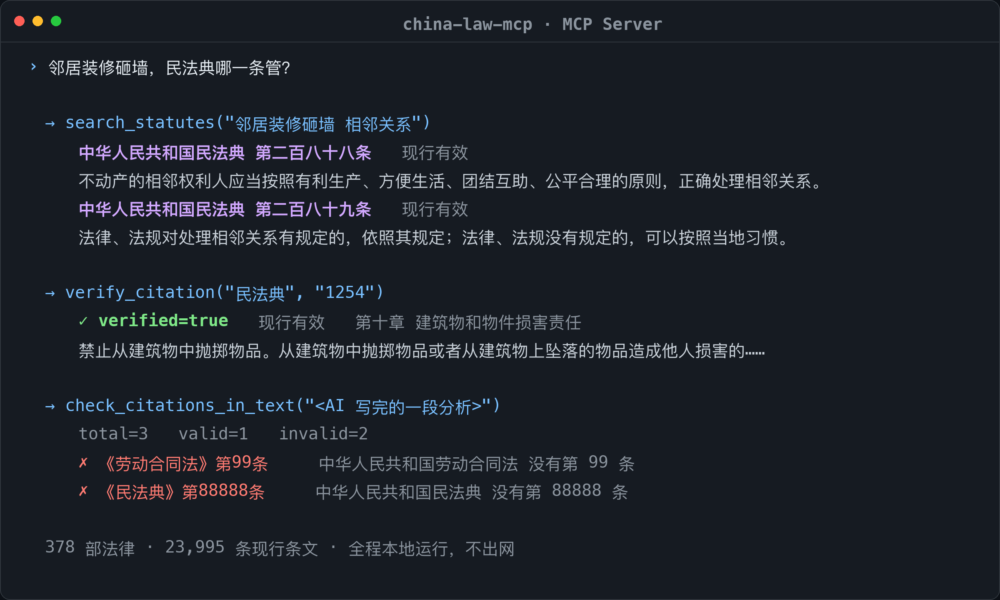

<div align="center">

# ⚖️ china-law-mcp

**Chinese statute retrieval + citation verification, as an MCP server.**

Free · No signup · No API key · Runs locally

[](LICENSE)
[](https://github.com/thu-lawyer/china-law-mcp/actions/workflows/ci.yml)
[](https://python.org)
[](https://pypi.org/project/china-law-mcp/)
[](https://modelcontextprotocol.io)
[](https://registry.modelcontextprotocol.io/v0/servers?search=china-law-mcp)
[](#data)
[](#data)

[中文](README.md) · English

</div>

<!-- mcp-name: io.github.thu-lawyer/china-law-mcp -->

---

## Why

Ask an LLM a Chinese legal question and it may cite **an article that does not exist**. You have no way to check. Law is the last domain where that is acceptable.

china-law-mcp gives your AI an **offline statute database plus a citation checker**:

- Before citing《民法典》Art. 1254, the model calls `verify_citation` — if it does not exist, it gets corrected.
- After drafting an answer, `check_citations_in_text` extracts **every** 《law》Art. N citation and reports the fabricated ones.
- To find the right article, `search_statutes` does natural-language retrieval over 23,995 articles.

Everything is local: no network, no signup, no API key.

## Quick start

```bash
uvx china-law-mcp
```

pip, Docker and clone-and-run also work:

```bash
pip install china-law-mcp && china-law-mcp
docker run -i --rm ghcr.io/thu-lawyer/china-law-mcp:latest
```

### Connect your client

A standard stdio server — any MCP client can drive it. Make sure `uvx` is on your PATH (it ships with `uv`).

| Client | How |
| --- | --- |
| **Claude Code** | One command: `claude mcp add china-law -- uvx china-law-mcp` |
| **Claude Desktop** | Edit `claude_desktop_config.json` (macOS: `~/Library/Application Support/Claude/`; Windows: `%APPDATA%\Claude\`) and restart |
| **Cursor** | Project `.cursor/mcp.json` or global `~/.cursor/mcp.json` |
| **VS Code** (Copilot Chat) | `.vscode/mcp.json` — note the top-level key is **`servers`**, not `mcpServers` |
| **Other clients** (Cherry Studio, ChatWise, LobeChat, DeepChat, …) | Paste the same JSON into their MCP settings page |

Swap `uvx` for Docker if you prefer.

```json
{
  "mcpServers": {
    "china-law": {
      "command": "uvx",
      "args": ["china-law-mcp"]
    }
  }
}
```

## Tools

| Tool | What it does |
| --- | --- |
| `search_statutes(query, top_k, law?)` | Natural-language query → relevant articles |
| `get_article(law, article_no)` | Law + article number → article text |
| `list_laws(keyword?, department?)` | Browse the statute catalogue |
| `verify_citation(law, article_no)` | **Check whether a citation actually exists** |
| `check_citations_in_text(text)` | **Extract all citations from a text and flag fabricated ones** |

## Demo

Real tool output, rendered as a terminal window (not a screenshot):



```text
verify_citation("民法典", "1254")   → verified=True
verify_citation("民法典", "9999")   → verified=False  (中华人民共和国民法典 没有第 9999 条)

check_citations_in_text("根据《民法典》第1254条…依据《劳动合同法》第99条和《民法典》第88888条…")
→ total=3, valid=1, invalid=2
→ invalid: ['《劳动合同法》第99条', '《民法典》第88888条']
```

## Use it as an Agent Skill (no MCP needed)

If your agent has no MCP support yet, or you just want to check one article from the shell, [`skills/china-law/`](skills/china-law/) ships the same capability:

- [`skills/china-law/SKILL.md`](skills/china-law/SKILL.md) — skill definition
- [`skills/china-law/law.py`](skills/china-law/law.py) — a CLI that needs **no `mcp` package**, only `china_law_mcp`'s retrieval and database modules

```bash
pip install china-law-mcp

python skills/china-law/law.py search "外卖吃出异物能退吗"
python skills/china-law/law.py verify 民法典 1254
python skills/china-law/law.py get 民法典 1254
python skills/china-law/law.py list 劳动
echo "根据《民法典》第1254条，另依据《民法典》第88888条。" | python skills/china-law/law.py check -

# every subcommand supports --json
python skills/china-law/law.py verify 民法典 1254 --json
```

Drop the `skills/china-law/` directory into your agent's skill folder: `~/.claude/skills/` or `.claude/skills/` for Claude Code, `~/.codex/skills/` for Codex, or `--skills-dir` for Kimi CLI.

## Data

378 statutes / 23,995 in-force articles (constitution, statutes, legislative interpretations). The SQLite DB (15 MB) ships with the repo and works out of the box; the BM25 index is built on first run (~6 s) and cached.

Bring your own corpus:

```bash
python scripts/build_corpus.py your_articles.jsonl     # → data/laws.db
```

Field reference is in the header of `scripts/build_corpus.py`. Two optional helpers live there too: `make_subset.py` (carve out a subset of statutes) and `encrypt_data.py` (encrypt the DB to `laws.db.enc`; servers can auto-decrypt it with the `CHINA_LAW_KEY` env var).

## How it works

```
question
   ↓
search_statutes   ← BM25 recall + colloquial synonym/co-occurrence expansion
   ↓                  + coverage & phrase reranking + direct article-number lookup
article text (with provenance)
   ↓
the model answers from the retrieved text
   ↓
check_citations_in_text   ← regex-extract 《law》Art. N, verify each against the DB
   ↓
fabricated citations are listed and dropped
```

Retrieval is a **pure local BM25** (`rank-bm25` + `jieba`). No external API, so no network dependency, no per-call cost, and your queries never leave the machine.

## Limitations

- Retrieval is a **BM25 baseline** with a hand-built colloquial-to-legal rule table (~40 rules). Treat the returned article text as ground truth.
- Scope is constitution / statutes / legislative interpretations only — no administrative regulations or judicial interpretations.
- Some in-force status flags are inferred inside the corpus (see the `status_basis` field).
- Not legal advice.

## Where it is listed

- **PyPI**: https://pypi.org/project/china-law-mcp/ (v0.1.1)
- **Official MCP Registry** (active): https://registry.modelcontextprotocol.io/v0/servers?search=china-law-mcp
- **Glama**: https://glama.ai/mcp/servers/thu-lawyer/china-law-mcp — tool-definition score **A**
- **Awesome lists**: PRs are open against [punkpeye/awesome-mcp-servers](https://github.com/punkpeye/awesome-mcp-servers) (Legal) and [yzfly/Awesome-MCP-ZH](https://github.com/yzfly/Awesome-MCP-ZH) — **still under review, not merged yet**
- Container image: `ghcr.io/thu-lawyer/china-law-mcp`

## Development

```bash
pip install -r requirements-dev.txt
PYTHONPATH=src pytest tests/ -v     # 12 tests covering retrieval, direct lookup, citation checks
```

Image and registry entries are published by tag:

```bash
git tag v0.1.2 && git push origin v0.1.2
```

Or trigger the **Publish image and register** workflow manually with a version number.

## Related

- [LawQ (律问)](https://github.com/thu-lawyer/lawq) — the same retrieval engine as a web app / mini program, with streaming answers
- [China administrative litigation case dataset](https://github.com/thu-lawyer/xingzheng-susongfa-case-index) — 635 cases, 425 full judgments

## License

[MIT](LICENSE). Statute text is compiled from public sources; follow the terms of those sources.
